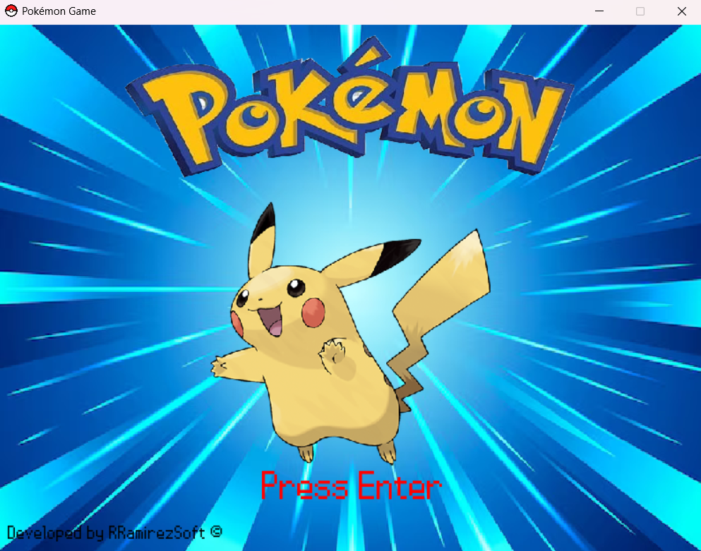
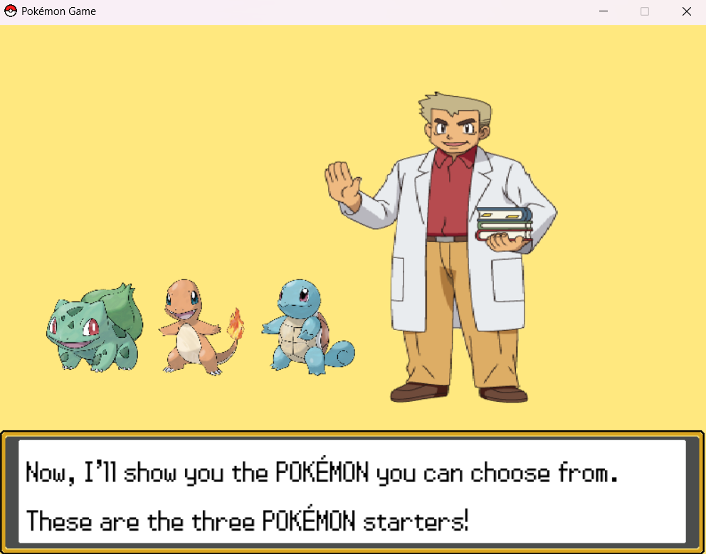
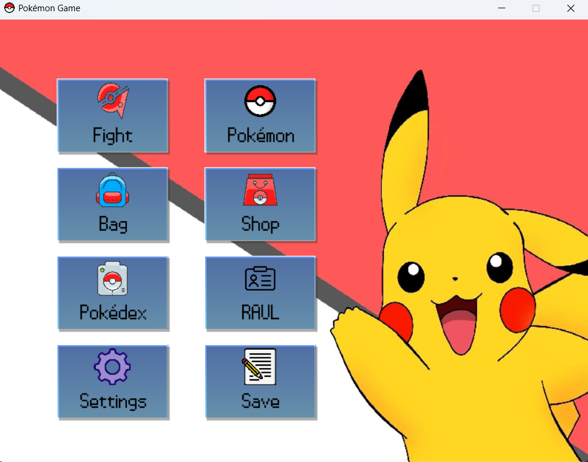
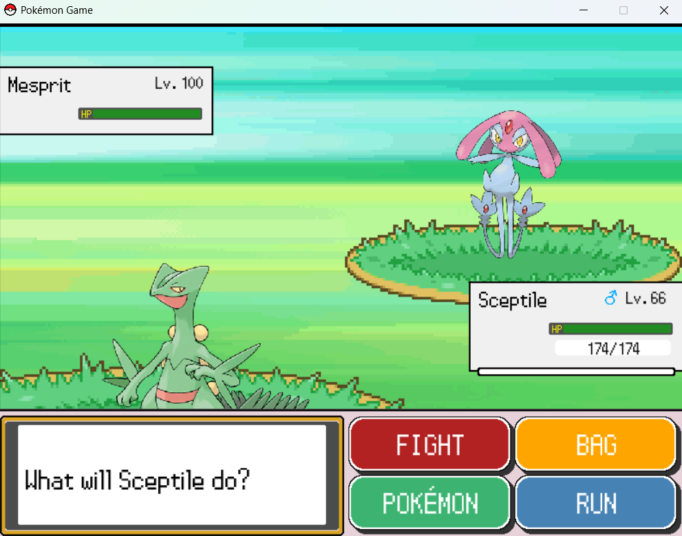
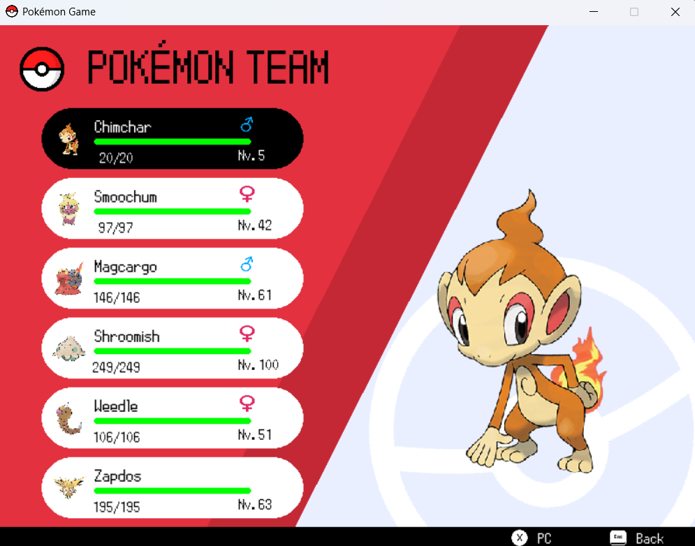
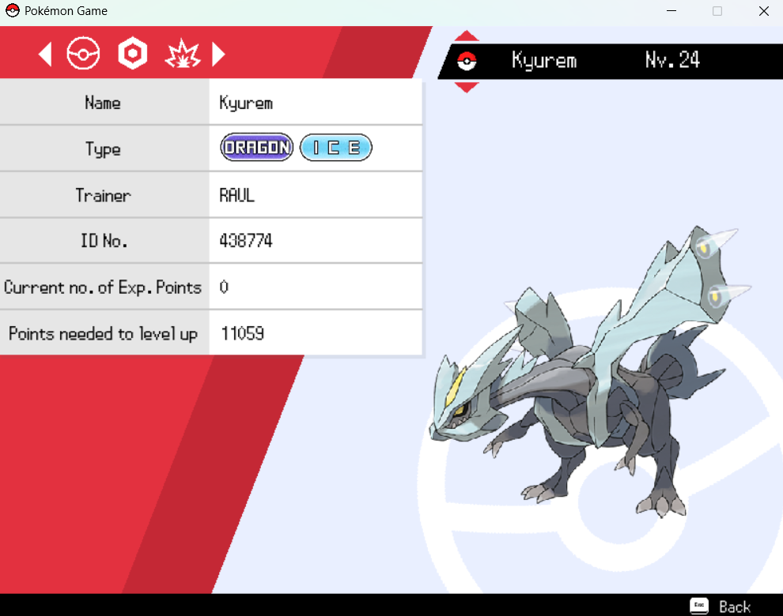
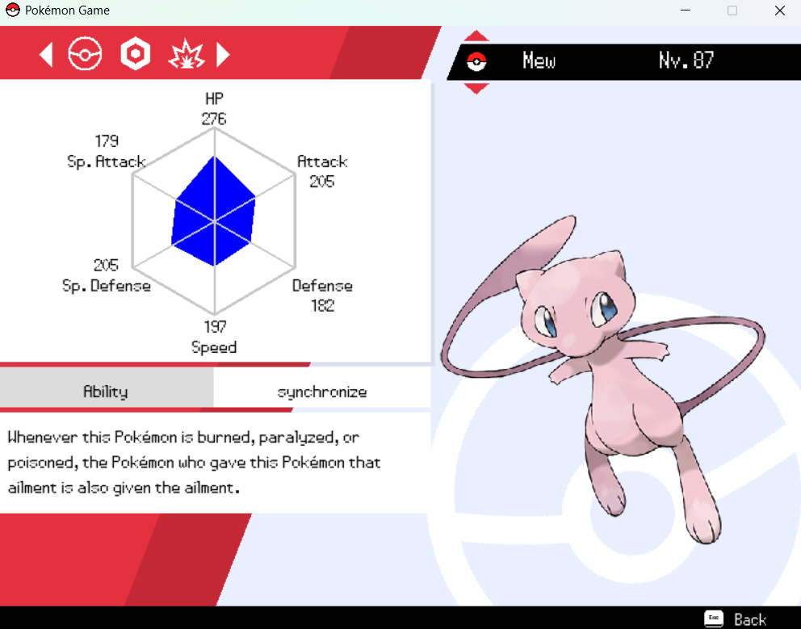
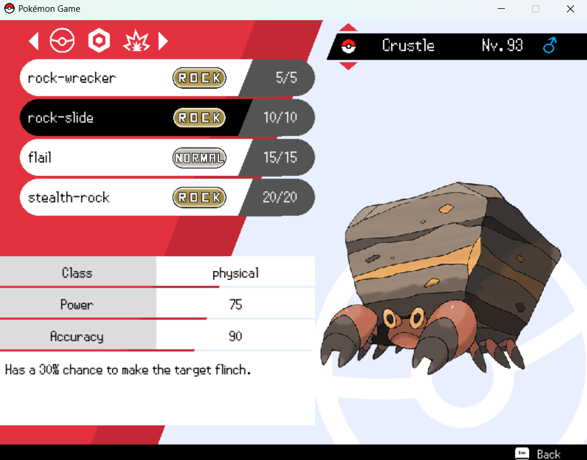
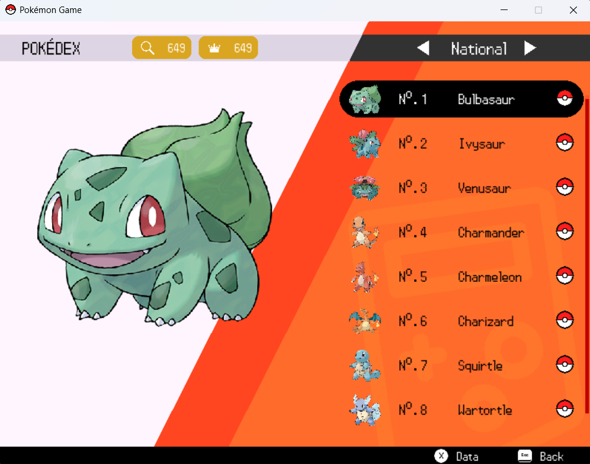
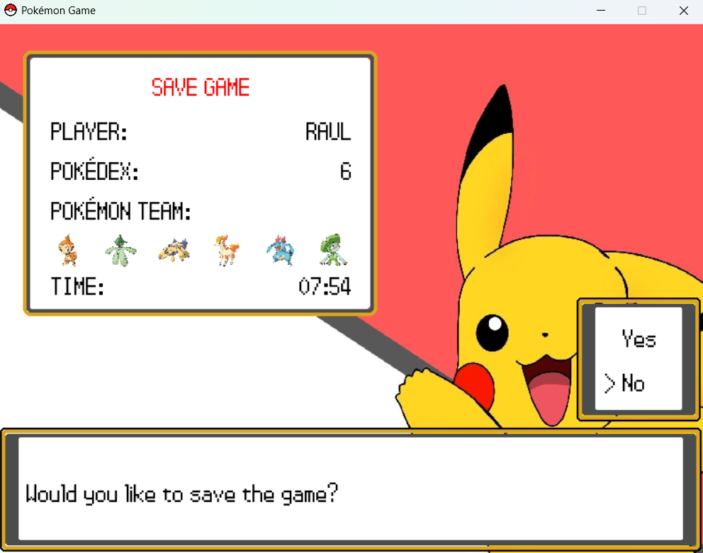

# **POKÉMON GAME**



Embark on an exciting adventure in the Pokémon world with this project. Choose your starter Pokémon, explore a vast
world full of challenges, and complete your mission to catch and register all Pokémon in your Pokédex. Get ready to
become the ultimate trainer!

---

## 🌟 **Game Features**

- **Starter Pokémon Selection**: Choose from classic starter Pokémon to begin your journey.
- **Pokémon Battles**: Face wild Pokémon and train your team to grow stronger.
- **Complete the Pokédex**: Catch and register all Pokémon from the Kanto, Johto, Hoenn, Sinnoh, Teselia regions, and the National Pokédex!
- **Explore Detailed Menus**: 
  - Manage your Pokémon team.
  - Look at your Pókemon's stats, moves, and abilities.
  - Store the rest of your Pokémon in the PC.
  - Check your items in the bag.
  - Buy more items in the PokéMart.
  - View your achievements on the trainer card.
  - Save your progress, and much more.


## 🕹️ Start Your Adventure

### Choose Your Starter Pokémon



Your first task as a trainer will be to choose your starting partner. Will you pick a Fire, Water, or Grass Pokémon? Your choice will shape the course of your adventure!

---

### Main Menu



From the main menu, you can access all game features. This will be your starting point for every session.

---

## 📜 Main Menu Features

### 1. **Battle**

Engage in battles with wild Pokémon! Train your team to gain experience and grow stronger.



---

### 2. **Pokémon Team**

Manage your Pokémon team with ease. Check stats, moves, and abilities. Access your storage boxes to swap and organize your team.



- **Pokémon Details**: Check the most important details of your Pokemon. (level, types, ID...)



- **Stats Screen**: View detailed stats for each Pokémon.



- **Moves Screen**: Check your Pokémon's moves and learn new ones.



- **Boxes**: Organize your captured Pokémon.

---

### 3. **Item Bag**

Review and use the items you've collected during your adventure. Find potions, Poké Balls, and other essential tools to aid your journey.

---

### 4. **Pokédex**

Explore the five regional Pokédexes (Kanto, Johto, Hoenn, Sinnoh, Teselia) and the National Pokédex. Your ultimate goal is to complete them all and become the best!



- **Pokédex Entries**: Check the Pokémon you've caught and registered.

---

### 5. **Trainer Card**

View your achievements and stats as a trainer. Showcase your badges and milestones on your personalized card.

---

### 6. **Shop**

Purchase essential items for your adventure. From Poké Balls to potions, ensure you're always prepared for any challenge.

---

### 7. **Settings**

Adjust sound, controls, and other settings to customize your experience.

---

### 8. **Save Game**

Make sure to save your progress so you can continue your adventure anytime.



---

## 🎯 Game Objective

Your main mission is to **complete all the Pokédexes**. As you capture Pokémon, you'll unlock badges and milestones reflecting your progress. Can you catch them all and become the ultimate Pokémon Master?

---

## 🚀 How to Play

To start your Pokémon adventure, follow these steps to set up and run the game:

## Option 1: Run the Game from Source Code

### Prerequisites

Ensure you have the following installed on your system:
- [Python 3.8+](https://www.python.org/downloads/) (recommended last version)
- [Git](https://git-scm.com/)

---

### Step 1: Clone the Repository

First, download the project files by cloning the repository:

```bash
# Clone the repository to your local machine
git clone https://github.com/<your-username>/<repo-name>.git

# Navigate to the project directory
cd <repo-name>
```
### Step 2: Create a Virtual Environment (Optional but Recommended)

```bash
# Create a virtual environment
python -m venv venv

# Activate the virtual environment
# On Windows:
venv\Scripts\activate
# On macOS/Linux:
source venv/bin/activate
```

### Step 3: Install Dependencies

```bash
# Install dependencies
pip install -r requirements.txt
```
### Step 4: Run the Game

```bash
# Start the game
python main.py
```

## Option 2: Download the Installer (Coming Soon)

The easiest way to play the game will be to download the installer directly from our website:

1. Visit my website [RRamirezSoft](http://rramirezsoft.com).
2. Navigate to the **Portfolio** section.
3. Locate the game project in the portfolio.
4. Download the installer provided there.

> **Note:** The final version of the installer is not yet available. Stay tuned for updates on the website!

---

Enjoy your journey into the world of Pokémon! 🎮   